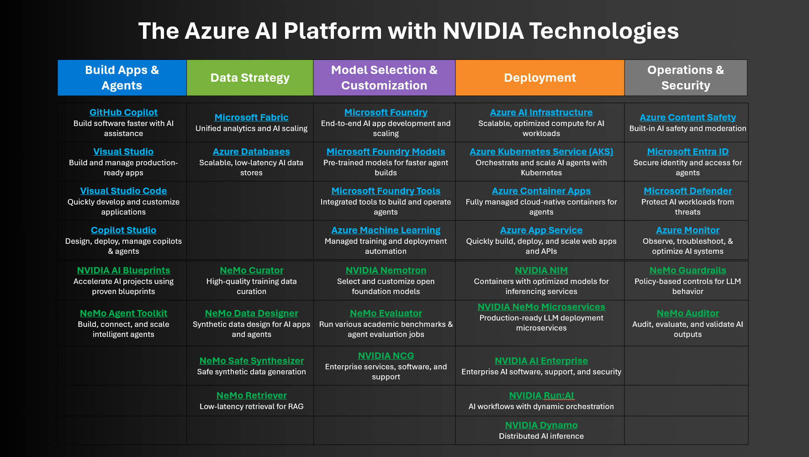

# Azure AI Platform with NVIDIA Technologies (Slide 6)

Source: Microsoft × NVIDIA Cards (With Speakers) Ep. 5 presentation

---

## Build Apps & Agents

### NVIDIA

- [NVIDIA AI Blueprints](https://build.nvidia.com/blueprints)
- [NeMo Agent Toolkit](https://docs.nvidia.com/nemo/agent-toolkit/1.4/index.html)

### Microsoft

- [GitHub Copilot](https://github.com/features/copilot)
- [Visual Studio](https://visualstudio.microsoft.com/)
- [Visual Studio Code](https://code.visualstudio.com/download)
- [Copilot Studio](https://adoption.microsoft.com/en-us/ai-agents/copilot-studio/)

---

## Data Strategy

### NVIDIA

- [NeMo Curator](https://docs.nvidia.com/nemo/curator/latest/index.html)
- [NeMo Data Designer](https://docs.nvidia.com/nemo/microservices/25.12.0/about/core-concepts/data-designer.html)
- [NeMo Safe Synthesizer](https://docs.nvidia.com/nemo/microservices/25.12.0/about/core-concepts/safe-synthesizer.html)

### Microsoft

- [Microsoft Fabric](https://www.microsoft.com/microsoft-fabric)
- [Azure Databases](https://azure.microsoft.com/products/category/databases)

---

## Model Selection & Customization

### NVIDIA

- [NVIDIA Nemotron](https://www.nvidia.com/en-us/ai-data-science/foundation-models/nemotron/)
- [NeMo Evaluator](https://developer.nvidia.com/nemo-evaluator)
- [NeMo Retriever](https://developer.nvidia.com/nemo-retriever/)
- [NVIDIA NGC (GPU Cloud)](https://www.nvidia.com/en-us/gpu-cloud/)

### Microsoft

- [Microsoft Foundry](https://azure.microsoft.com/en-us/products/ai-foundry/)
- [Microsoft Foundry Models](https://azure.microsoft.com/en-us/products/ai-foundry/models/)
- [Microsoft Foundry Tools](https://azure.microsoft.com/en-us/products/ai-foundry/tools/)
- [Azure Machine Learning](https://azure.microsoft.com/en-us/products/machine-learning/)

---

## Deployment

### NVIDIA

- [NVIDIA NIM](https://developer.nvidia.com/nim)
- [NVIDIA NeMo Microservices](https://www.nvidia.com/en-us/ai-data-science/products/nim-microservices/)
- [Run:AI on Microsoft Azure](https://www.run.ai/solutions/microsoft-azure/)
- [NVIDIA Dynamo](https://www.nvidia.com/en-us/ai/dynamo)

### Microsoft

- [Azure AI Infrastructure](https://azure.microsoft.com/en-us/solutions/high-performance-computing/ai-infrastructure)
- [Azure Kubernetes Service (AKS)](https://azure.microsoft.com/products/kubernetes-service)
- [Azure Container Apps](https://azure.microsoft.com/en-us/products/container-apps/)
- [Azure App Service](https://azure.microsoft.com/en-us/products/app-service/)

---

## Operations & Security

### NVIDIA

- [NeMo Guardrails](https://developer.nvidia.com/nemo-guardrails)
- [NeMo Auditor](https://docs.nvidia.com/nemo/microservices/latest/audit/index.html)
- [NVIDIA AI Enterprise](https://www.nvidia.com/en-us/data-center/products/ai-enterprise/)

### Microsoft

- [Azure Content Safety](https://azure.microsoft.com/en-us/products/ai-services/ai-content-safety)
- [Microsoft Entra ID](https://www.microsoft.com/security/business/identity-access/microsoft-entra-id)
- [Microsoft Defender](https://www.microsoft.com/en-ca/security/business/microsoft-defender)
- [Azure Monitor](https://azure.microsoft.com/en-us/products/monitor)
